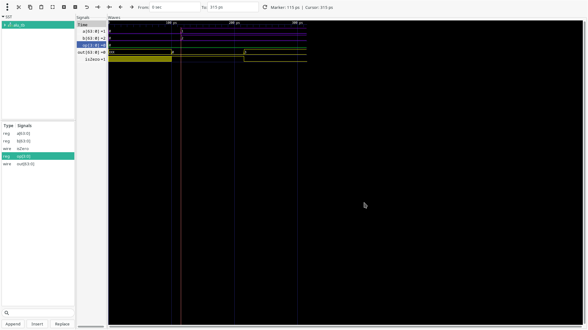

## ALU

this alu is part has three inputs and two outputs
### *Inputs*
- 4 bit opcode
- a,b 64 bits values

### *Outputs*
- result is 64 bit
- zero is wire that is high if result is zero

##### add tests

##### sub tests

##### and tests

##### or tests

## Register file

register file that has 32 register and each register is of size 64 bit
32 registers means that we need 5 wires to select a register
### *Inputs*
- 5 bit readRegister1
- 5 bit readRegister2
- 5 bit writeRegister
- 1 bit regWrite  should we write data to a register 
- 64 bit writeData  data to be written 

## *Outputs*
- 64 bit readData1
- 64 bit readData2

##### initial tests

